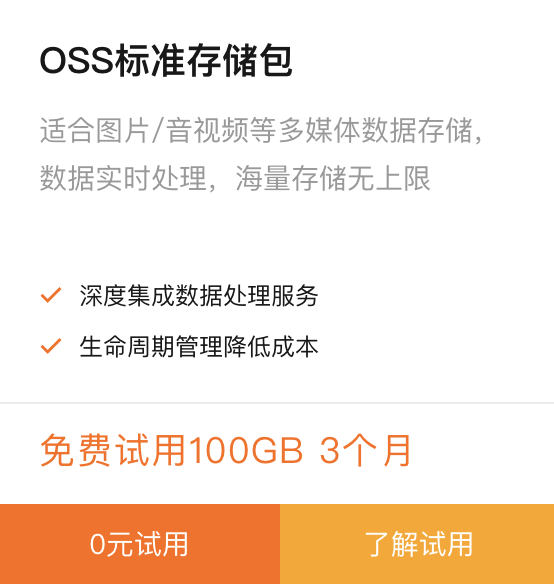
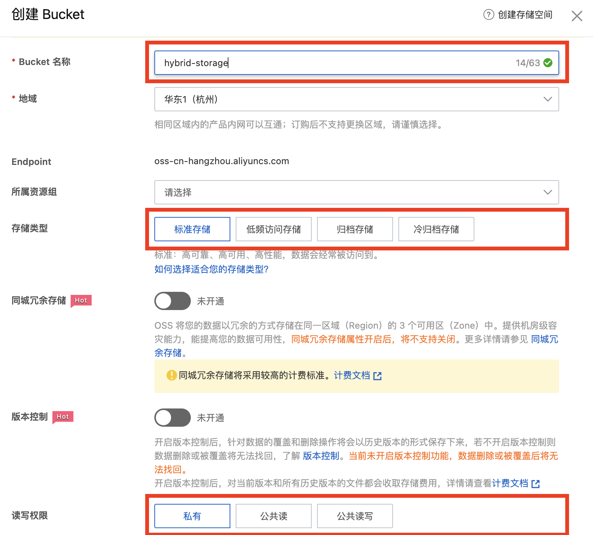
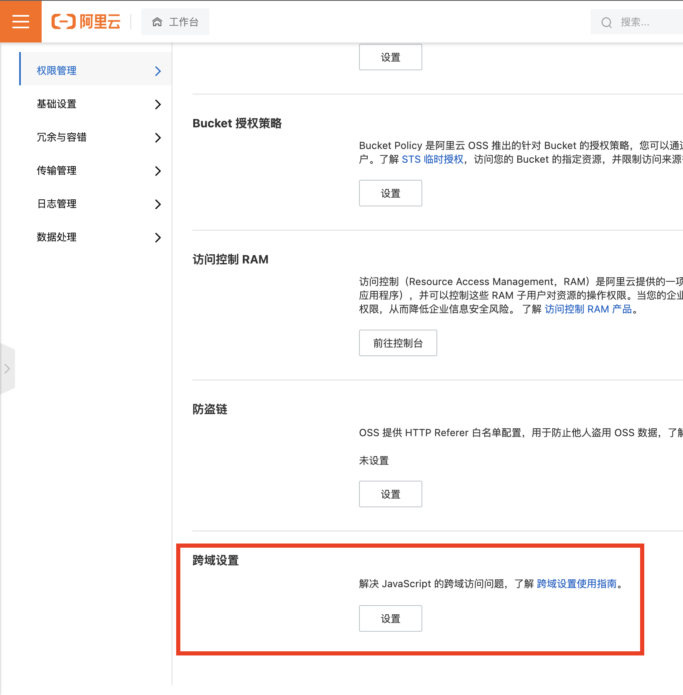
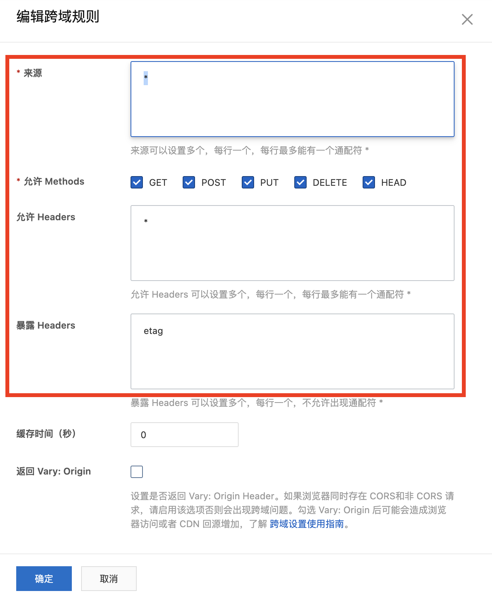
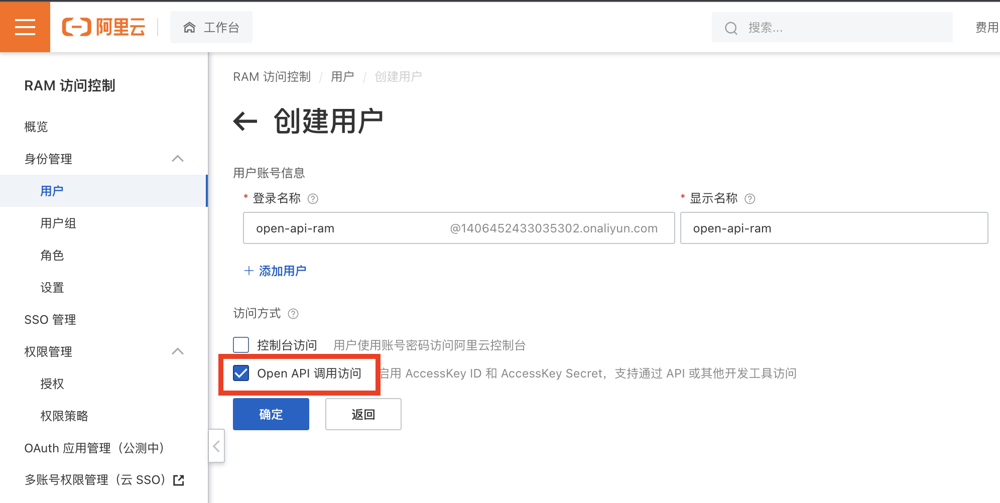

# 干货：我做了一个免费的 JSON 云端存储同步方案

## 1. 前言

相信有不少前端同学在做实验性项目或私有项目的时候，都遇到过这样的需求：

* 有相对较小的键值对数据据需要存储在本地的 `LocalStorage` 或 `IndexedDB` 里，包括设置项、小体积实例数据等

* 需要将上述数据与云端进行同步，同时又能保证离线的情况下也能够使用

* 国内访问速度要极快

* 具有一定的安全私密性

* 没有服务器资源，自己不想写任何一行服务端代码

* **一定要是免费的！**

笔者最近用阿里云的[**对象存储云存储服务**](https://www.aliyun.com/product/oss)（Object Storage Service，下简称为 **OSS**）搭建了一套纯前端实现的 JSON 云存储解决方案。最关键的是，如果你是阿里云新用户，可以免费使用头 3 个月，并且第一年的成本[只有区区 9 块钱](https://common-buy.aliyun.com/?spm=5176.7933691.J_1309840.2.2e394c59sCe8zx&commodityCode=ossbag#/buy?request=%7B%22region%22:%22china-common%22,%20%22ossbag_type%22:%22storage_std_zrs%22,%20%22std_zrs_storage_bag_spec%22:%221024%22,%20%22ord_time%22:%221:Year%22%7D)，但却有多达 40GB 的空间！

本文就将详细阐述笔者如何实现这样一个解决方案的，其中包含：

* **阿里云 OSS 简介**

* **HybridStorage 解决方案设计**
  * **序列化与反序列化**

  * **本地与 OSS 数据存储器**

  * **异步任务队列**

  * **自动本地与云端双向同步**

**干货文章比较长，本文中所有涉及到的代码都已放在 [我的 Github 上](https://github.com/MagicCube/hybrid-storage)，欢迎收藏和提 Issue。**

> **提示**：本文以面向对象编程风格为主，涉及一些简单的设计模式和双向同步算法，使用的语言是 TypeScript，工程化使用的是 Vite。


## 2. 阿里云 OSS

### 2.1 OSS 简介

> 阿里云对象存储OSS（Object Storage Service）是一款海量、安全、低成本、高可靠的云存储服务，提供99.9999999999%(12个9)的数据持久性，99.995%的数据可用性。多种存储类型供选择，全面优化存储成本。

以上是阿里云在[官网](https://www.aliyun.com/product/oss)上的介绍。对于前端来说，我们可以简单的将 OSS 理解成是一种

* 文件存储服务
* 云端存储，无需架设服务器
* 超级廉价
* 超级稳定
* 全球范围读写速度极快

平时我们最常使用的 CDN 文件就是基于 OSS 进行存储和暴露的。


### 2.2 免费开通 100 GB 空间

> **敬告读者**：本文主要阐述的是阿里云 OSS，你也可以用任何 OSS 服务替换，如七牛云等。本人没有与阿里云有任何有偿合作关系。

免费开通 3 个月的阿里云 OSS 服务非常简单，你只需要：

1. 首先通过支付宝身份[注册成为阿里云的实名认证个人用户](https://account.aliyun.com/register/qr_register.htm)。

2. 如果你是新人，可在 [新人试用中心](https://free.aliyun.com/)首页的搜索框中搜索“OSS”，即可开通新人礼包；或者你也可以[在这里](https://common-buy.aliyun.com/?commodityCode=ossbag#/buy)根据自己的需要，开通超低折扣的套餐。

   

3. **请务必参考本文末尾的附录**，创建并设置 Bucket 和 RAM 用户。其中，Bucket 相当于是一块虚拟的云端硬盘，而 RAM 用户则是可以通过 Access Key 访问阿里云 API 的虚拟角色用户。


### 2.3 通过官方 SDK 操作 OSS

阿里云官方提供了 `ali-oss` 的 [SDK 包](https://github.com/ali-sdk/ali-oss)，并且有完善的 TypeScript 支持，你可以通过下面的命令进行安装：

```shell
npm install ali-oss
npm install @types/ali-oss -D
```

你可以通过下面的代码上传或覆盖指定的 JSON 数据文件：

```typescript
// 创建一个 OSS 客户端对象
const oss = new OSS({
  // 根据你的 bucket 和 RAM 用户进行设置
  region: 'oss-cn-hangzhou',
  accessKeyId: '<YOUR_ACCESS_KEY_ID>',
  accessKeySecret: '<YOUR_ACCESS_KEY_SECRET>',
  bucket: '<YOUR_BUCKET_NAME>',
});

// 需要上传的数据
const data = { foo: 'foo', bar: 'bar' }
const rawString = JSON.stringify(data);
// 创建一个 MIME 类型为“application/json” 的 Blob 对象
const blob = new Blob([rawString], { type: 'application/json' });
// 异步上传 Blob 对象，并存储在指定的文件路径
const { res } = await oss.put('/example/test.json', blob);
// 如果你在前面的跨域权限步骤中设置正确的话，就能从响应头中获得 etag 信息，
// 也就是该文件的 MD5 哈希值
const etag = res.headers.etag;
console.info(etag);
```

除了上传文件外，你还可以进行查询、搜索、删除甚至软连接文件等操作，在[官方的SDK 文档](https://help.aliyun.com/document_detail/32067.html)中写的非常详尽。


## 3. 设计实现 JSON 云端存储同步方案

### 3.1 需求说明

现在到了本文的重点，即实现一个 JSON 存储的云端解决方案，我们暂可称其命名为 **HybridStorage**，即混合存储，我们希望能够做到：

1. 存储对象为字面量，即可被 JSON 序列化的简单数据
2. 用户无需了解 OSS、数据同步等技术细节，就像用 `LocalStorage` 一样简单实现增删改查
3. 云端存储，在网络离线时亦可继续使用，并在网络恢复时自动与云端进行同步
4. 所有读写操作都是返回 `Promise` 的异步操作
5. 同步的过程尽量不要影响页面性能


### 3.2 HybridStorage 概要设计

根据上述需求，我设计了这样的一个方案：

* 用本地的 LocalStorage 和云端的 OSS 文件同时存储 JSON 键值对数据
* 键值对数据通过序列化以 JSON 字符串的形式进行传输及存储
* 定义一个 **`AsyncStorage` 通用接口**，分别针对本地存储器（**`AsyncLocalStorage` 类**）和 OSS 存储器（**`AliOSSStorage` 类**）对该接口进行各自实现，从而以无差异的方式访问 LocalStorage 和 OSS 服务。
  * `AsyncLocalStorage` 类 直接通过 `LocalStorage` 中的键值对进行存储。
  * 而在 `AliOSSStorage` 类中，键是 OSS 云端文件的名称（包含路径），值则作为内容存储在文件中。
* 读操作默认走本地的 `LocalStorage`，写操作则是先写本地，然后再以异步操作队列（**`AsyncQueue` 类**）同步至服务端。
  * 数据同步的逻辑通过 **`StorageSynchronizer` 类**实现，主要是通过比对本地和远程的哈希值索引，再通过 `pull()` 和 `push()` 双向同步。
  * 同步队列本身也存储在 `LocalStorage` 中，这样在离线或同步失败后可以多次重试。
* 最后将 `AsyncLocalStorage`、`AliOSSStorage` 和 `StorageSynchronizer` 等类进行集成，封装为 **`HybridStorage` 类** ，该类同样实现了 `AsyncStorage` 接口，最终的用户只需通过该类进行本地及 OSS 云端数据的读写，而不用关心上述所有细节。


### 3.3 HybridStorage 详细设计与实现

#### 3.3.1 序列化

首先，我们需要用 TypeScript 定义什么数据可以被序列化（即可被存储或传输）。可被序列化（Serializable）的数据类型包括：

* `String`
* `Number`
* `Boolean`
* `null`
* 以上述类型组成的数组及简单对象

我们可以用 TypeScript 将上述类型可描述为 **`Serializable` 类型**：

```typescript
/**
 * 完整代码请参考：
 * https://github.com/MagicCube/hybrid-storage/blob/master/src/serializing/Serializable.ts
 */

export type PrimitiveValue = string | number | boolean;

export type Serializable =
  | Nullable<PrimitiveValue>
  | Array<MaybeNullable<Serializable>>
  | { [key: string]: MaybeNullable<Serializable> };
```

> **提示**：`Nullable`、`Maybe`、`MaybeNullable` 等是事先约定的泛型工具，[具体定义在这里](https://github.com/MagicCube/hybrid-storage/blob/master/src/typings/util.d.ts)。


尽管目前我们只支持 JSON 序列化这一种形式，但是一个良好的设计需要有一定的“前瞻思维”，为了将来支持数据压缩、数据加解密、[BSON](https://www.mongodb.com/json-and-bson) 格式存储等功能，我们还应先定义一个 **`Serialzer` 接口**，并为其实现一个 **`JSONSerializer` 类**。

```typescript
/**
 * 表示序列化器的通用接口。
 *
 * 完整代码请参考：
 * https://github.com/MagicCube/hybrid-storage/blob/master/src/serializing/Serializer.ts
 *
 * 针对 JSON 序列化的实现类 JSONSeiralizer 请参考：
 * https://github.com/MagicCube/hybrid-storage/blob/master/src/serializing/JSONSerializer.ts
 */
export interface Serializer<T = string> {
  /**
   * 将指定的值序列化为 T 类型。
   * @param value 指定要被序列化的值。
   */
  serialize(value: Serializable): T;

  /**
   * 将指定的 T 类型反向序列化为对应的值。
   * @param value 指定要被反向序列化的值。
   */
  deserialize(value: T): Serializable;
}
```


#### 3.3.2 异步键值对存储器接口

接下来，我们定义一个可异步读写访问的键值对存储器接口。每一个存储器都有一个全局唯一的 `instanceName`，用于定位和隔离数据存储。浏览器原生提供了[Storage API 接口](https://developer.mozilla.org/zh-CN/docs/Web/API/Storage)，并基于该接口实现了 `LocalStorage` 和 `SessionStorage`，相信大多数前端同学对此都不会陌生，遗憾的是 `Storage` 接口中的方法全部都是同步的，因此我们需要参考它的命名和参数，重新定一个全新的异步键值对存储器接口，即 `AsyncStorage` 接口：

```typescript
/**
 * 表示异步存储器的接口。
 *
 * 完整代码请参考：
 * https://github.com/MagicCube/hybrid-storage/blob/master/src/storing/AsyncStorage.ts
 */
export interface AsyncStorage {
  /**
   * 获取此存储提供者实例的名称。
   */
  readonly instanceName: string;

  /**
   * 返回指定键对应的值。
   * 如果指定键不存在，则返回 `defaultValue` 的值。
   *
   * @param key 指定的键。
   * @param defaultValue 指定默认值，当指定键不存在时返回，建议默认为 `undefined`。
   */
  getItem(
    key: string,
    defaultValue?: Maybe<Serializable>,
  ): Promise<Maybe<Serializable>>;

  /**
   * 返回一个用于描述当前存储器中所有项的元数据索引。
   */
  getMetaIndex(): Promise<StorageMetaIndex>;

  /**
   * 返回该存储提供者中所有键的列表。
   */
  keys(): Promise<string[]>;

  /**
   * 设置指定键的值。
   * @param key 指定的键。
   * @param value 指定键对应的值。
   * @returns 返回 `value` 的哈希值。
   */
  setItem(key: string, value: Serializable): Promise<string>;

  /**
   * 移除指定键对应的项。
   */
  removeItem(key: string): Promise<void>;
}
```

没有什么比源代码更好的接口描述方式了，正如以上代码所示，`AsyncStorage` 接口实现了 `getItem()` 方法实现数据的异步读取，并通过 `setItem()` 和 `removeItem()` 实现异步修改（含添加）和删除操作。其中，`getMetaIndex()` 方法异步返回的是一个包含键值对元数据的索引信息，其定义如下所示：

```typescript
/**
 * 表示存储元数据索引的结构体。
 */
export interface StorageMetaIndex {
  [key: string]: {
    /**
     * 存储对象的 etag 标签值。
     *
     * 该值通常为存储对象的内容的 MD5 哈希值。
     */
    etag: string;
  };
}
```

可以看出所谓“元数据索引”最重要的记录的是每一个键对应的 `etag` 值，也就是对值进行 MD5 哈希之后的值，这个值有助于本地与远程同步时的快速比对。当在云端上新建或更新文件时，OSS 服务会在 HTTP 响应头中包含 `etag`，即文件内容的哈希值，我们正巧可以直接利用；而对于 `LocalStorage`、`IndexedDB` 等本地存储而言，则可以通过 [`md5 库`](https://www.npmjs.com/package/md5) 在客户端自行计算。

> **提示**：你也可以用自增长的版本号、乐观锁、悲观锁实现替代 `etag` 方案，因实现较为复杂，本文将不会涉及。


#### 3.3.3 本地键值对存储器

我们来看一下 `AsyncStorage` 接口 的第一个实现类——AsyncLocalStorage，如果你打开 Github 浏览[它的源代码](https://github.com/MagicCube/hybrid-storage/blob/master/src/storing/async-local-storage/AsyncLocalStorage.ts)，不难发现基本上就是将浏览器内置的 `LocalStorage` 进行了异步的封装，`key` 的规则是`$instanceName/$key`，也就是用 `instanceName` 作为前缀。

```typescript
/**
 * AsyncLocalStorage 的完整代码请参考：
 * https://github.com/MagicCube/hybrid-storage/blob/master/src/storing/async-local-storage/AsyncLocalStorage.ts
 */

// 'example' 是存储器实例的名称
const storage = new AsyncLocalStorage('example');

// 异步设值
await storage.setItem('city', 'Hangzhou');
await storage.setItem('province', 'Zhejiang');

// 异步取值
const city = await storage.getItem('city');
console.info(city); // 输出 "Hangzhou"

// 支持同步取值
const province = storage.getItemSync('province');
console.info(province); // 输出 "Zhejiang"

// 如果默认值
const value = await storage.getItem('NEW_KEY', 'default value');
console.info(value); // 输出 "default value"
```

执行完上述代码后，LocalStorage 的值变更为如下图所示：


由于我们在 `AsyncLocalStorage` 类的构造函数中传入了名为 `example` 的 `instanceName`，因此所有键都自动加上了 `example/` 的前缀，除了用户自定义的 `example/city` 和 `example/province` 两个键外，还多了一个键为 `example/@meta` 的特殊值，用于记录索引哈希信息，我们稍后会在同步器中使用它进行对比。

为了特殊场景下可以立即的获取存储器中的值，我们还为 `AsyncLocalStorage` 类额外添加了 `getItemSync()` 同步取值的方法。

`AsyncLocalStorage` 类相对简单，我们就先介绍到这里，接下来我们来看如何实现云端 OSS 存储。


#### 3.3.4 OSS 键值对存储器

`AliOSSStorage` 类同样实现了 `AsyncStorage` 接口 ，我们希望在 `AliOSSStorage` 类外先去创建 `OSS` 类的实例，并在构造器中传入：

```typescript
/**
 * 为阿里云 OSS 存储服务实现的异步存储器类。
 *
 * @implements
 * 该类实现了 {@link AsyncStorage} 接口。
 *
 * 完整代码请参考：
 * https://github.com/MagicCube/hybrid-storage/blob/master/src/storing/ali-oss-storage/AliOSSStorage.ts
 */
export class AliOSSStorage implements AsyncStorage {
  /**
   * 创建 `AliOSSStorage` 类的新实例。
   * @param instanceName 指定存储器的实例名称。
   * @param oss 指定的 {@link OSS} 类的实例。
   */
  constructor(readonly instanceName: string, readonly oss: OSS) {}

  // ...
}


// 使用 AliOSSStorage
import OSS from 'ali-oss';

// 根据你的实际配置，创建 OSS 客户端
const oss = new OSS({
  // ...
});
// 将 `OSS` 作为参数传入 `AliOSSStorage` 类的构造器
const storage = new AliOSSStorage('example', oss);
```

正如前文中提到的那样，键值对中的 `key` 将被视为 OSS 云端的文件名（含路径），而值则以 JSON 字符串的形式存储在文件内容中。这里先列出最为核心的 `getItem()` 和 `setItem()` 方法：

```typescript
/**
 * 完整代码请参考：
 * https://github.com/MagicCube/hybrid-storage/blob/master/src/storing/ali-oss-storage/AliOSSStorage.ts
 */
export class AliOSSStorage implements AsyncStorage {
  // ...

  async getItem(
    key: string,
    defaultValue: Maybe<Serializable> = undefined,
  ): Promise<Maybe<Serializable>> {
    let jsonString: string;
    try {
      // 根据 `key` 获取文件名（含路径）
      const fileName = this._getFileName(key);
      // 从 OSS 服务中获取文件内容
      const { content } = await this.oss.get(fileName);
      jsonString = content.toString();
    } catch (e) {
      if (e instanceof Error && e.name === 'NoSuchKeyError') {
        // OSS 服务报告”NoSuchKeyError“错误，
        // 即文件路径不存在，则返回默认值
        return defaultValue;
      } else {
        // 其他的异常则原封未动的抛出
        throw e;
      }
    }
    // 将 JSON 字符串反序列化为值
    const result = this._serializer.deserialize(jsonString);
    return result;
  }

  async setItem(key: string, value: Serializable): Promise<string> {
    if (value === undefined) {
      throw new Error('Undefined value is not allowed.');
    }
    // 序列化为 JSON 字符串
    const jsonString = this._serializer.serialize(value);
    // 封装为 Blob 对象
    const blob = new Blob([jsonString], { type: 'application/json' });
    // 根据 `key` 生成对应的文件名（含路径）
    const fileName = this._getFileName(key);
    // 执行上传，OSS 会自行决定是新建还是覆盖文件
    const result = await this.oss.put(fileName, blob);
    // 如果上传成功，则从 HTTP 响应头中获得 etag，并将其返回。
    const { etag: etagWithDoubleQuotes } = result.res.headers as {
      etag: string;
    };
    // 要注意的是 OSS SDK 返回的 etag 两头会各多一个英文引号，我们要去掉它们。
    return dropQuotes(etagWithDoubleQuotes);
  }

  private _getFileName(key: string): string {
    return `${this.instanceName}/${key}.json`;
  }

  private _getKeyFromFileName(fileName: string) {
    return fileName
      .substring(this.instanceName.length + 1)
      .replace(/\.json$/, '');
  }

  // ...
}

```

由于 OSS 服务本身就有根据前缀查询文件列表的 API 方法，因此我们可以直接利用它去实现 `getMetaIndex()` 方法。

```typescript
/**
 * 完整代码请参考：
 * https://github.com/MagicCube/hybrid-storage/blob/master/src/storing/ali-oss-storage/AliOSSStorage.ts
 */
export class AliOSSStorage implements AsyncStorage {
  // ...

  async getMetaIndex(): Promise<StorageMetaIndex> {
    // `list` 方法可以根据前缀，查询文件的元数据信息，
    // 其中就包含了 etag 信息。
    // 单次查询最多可一次性返回 1000 个文件的信息。
    const list = await this.oss.list(
      {
        prefix: `${this.instanceName}/`,
        'max-keys': 1000,
      },
      {},
    );
    return list.objects.reduce((result, obj) => {
      const key = this._getKeyFromFileName(obj.name);
      result[key] = { etag: dropQuotes(obj.etag) };
      return result;
    }, {} as StorageMetaIndex);
  }

  // ...
}
```


#### 3.3.5 存储同步器与异步任务队列

在概要设计中，我们提到存储同步器（StorageSynchronizer）可在两个实现了 `AsyncStorage` 接口 的存储器之间进行数据同步，为了更好的理解，我们将它们分别命名为本地存储器（`localStorage`）和远端存储器（`remoteStorage`），并需要在构造器中传入它们。

```typescript
/**
 * 表示存储同步器的类，用于在本地及云端存储器之间进行数据同步。
 *
 * 完整代码请参考：
 * https://github.com/MagicCube/hybrid-storage/blob/master/src/synchronizing/StorageSynchronizer.ts
 */
export class StorageSynchronizer {
  /**
   * 根据指定的本地与远端存储器创建同步器 `StorageSynchronizer` 类的新实例。
   */
  constructor(
    readonly localStorage: AsyncStorage & {
      getItemSync: Unpromisify<AsyncStorage['getItem']>;
    },
    readonly remoteStorage: AsyncStorage,
  ) {
  	// TODO: 实现初始逻辑
  }

  // ...
}
```


本地与远端数据同步的方法有很多种，这里我们可以先参考 Git：

* **拉取（`Pull`）**，即将远端增删改的数据更新到本地的过程，该过程需要先通过对比本地和远端索引的差异生成补丁，然后再将补丁应用于本地存储。
* **推（`Push`）**，即将本地的**变更（`SyncCommit`）**以**异步任务队列（`AsyncQueue`）**提交到远端 OSS 的过程。
* 因此一次同步的过程，就是先将远端的变更 `Pull` 到本地执行，然后再执行 `Push` 将本地的变更提交到远端 OSS。

首先我们来看一下 Pull 过程的要点：

##### 原子级操作 SyncCommit

我们将所有增删改原子级操作都可以抽象为是一个 `SyncCommit`，例如下面这个 `commit` 表示需要在远端修改键为 `city` 的值，将其修改为 `Hangzhou`，发起这个 `commit` 的原因是本地的值发生了变更，并且被压入了队列。

```typescript
const commit: SyncCommit = {
  type: 'set',
  target: 'remote',
  key: 'city',
  value: 'Hangzhou',
  reason: 'local-updated',
  staging: 'queued'
};
```

##### 差异与补丁 Diff & Patch

如下方代码所示，在 Pull 的过程中，首先我们需要根据两份分别来自本地和远端的索引，计算它们之间的差异（Diff），并且根据差异生成对应的补丁（Patch），这里补丁可以理解成为“解决”该差异需要进行的原子级操作，因此同样可以用 `SyncCommit` 来进行描述。

```typescript
/**
 * 表示存储同步器的类，用于在本地及云端存储器之间进行数据同步。
 */
export class StorageSynchronizer {
  // ...

  // 根据差异生成补丁列表
  private _generatePatches(
    local: StorageMetaIndex,
    remote: StorageMetaIndex,
  ): SyncCommit[] {
    const patches: SyncCommit[] = [];

    // 查找远端存储器中已经不存在的项，或已更改过的项。
    for (const [key, value] of Object.entries(local)) {
      if (!remote[key]) {
        patches.push({
          target: 'local',
          type: 'remove',
          key,
          reason: 'remote-removed',
          staging: 'patching',
        });
      } else if (remote[key].etag !== value.etag) {
        patches.push({
          target: 'local',
          type: 'update',
          key,
          reason: 'remote-updated',
          staging: 'patching',
        });
      }
    }

    // 查找远程新增的项。
    for (const key of Object.keys(remote)) {
      if (!local[key]) {
        patches.push({
          target: 'local',
          type: 'update',
          key,
          reason: 'remote-added',
          staging: 'patching',
        });
      }
    }
    return patches;
  }

  // 应用补丁
  private async _applyCommit(commit: SyncCommit) {
    logger.info('Committing', commit);

    const sourceStorage =
      commit.target === 'remote' ? this.localStorage : this.remoteStorage;
    const targetStorage =
      commit.target === 'local' ? this.localStorage : this.remoteStorage;
    switch (commit.type) {
      case 'set':
        await sourceStorage.setItem(commit.key, commit.value);
        await targetStorage.setItem(commit.key, commit.value);
        break;
      case 'update':
        const value = await sourceStorage.getItem(commit.key);
        if (value) {
          await targetStorage.setItem(commit.key, value);
        }
        break;
      case 'remove':
        await targetStorage.removeItem(commit.key);
        await sourceStorage.removeItem(commit.key);
        break;
    }
  }

  // ...
}
```

##### 异步任务队列 AsyncQueue

同步的另一个难点则是异步任务队列，一个异步任务队列应当具备如下特征：

* 队列中的每一个任务都是异步执行的，按“先进先出”的顺序依次执行
* 队列的执行优先级较低，执行过程可以随时被暂停，本例中通过 [`window.requestIdleCallback()` 方法](https://developer.mozilla.org/zh-CN/docs/Web/API/Window/requestIdleCallback) 实现任务调度，尽可能的减少同步任务执行对主线程中其他渲染、逻辑的执行
* 通过 `enqueue()` 方法可将一个异步任务放入队列的最末端
* 通过 `length` 和  `isEmpty` 属性可查看当前异步任务的执行情况
* 可将未能完成的任务，存储在本地的 `LocalStorage` 中，当网络恢复时尝试继续执行

异步任务队列的代码，请直接[在 Github 中查看](https://github.com/MagicCube/hybrid-storage/blob/master/src/queuing/AsyncQueue.ts)。


异步任务队列被以 `commitQueue` 的形式封装在 `StorageSynchronizer` 中，在下一章节中我们会看到如何使用 `StorageSyncrhonizer`。


#### 3.3.6 集大成——HybridStorage

最后让我们将 `AsyncLocalStorage`、`AliOSSStorage`和 `StorageSynchronizer` 聚合在一起，组成 `HybridStorage` 类：

```typescript
/**
 * `HybridStorage` 是一种可在本地离线与云端之间同步 JSON 对象的存储器。
 *
 * 完整代码请参考
 * https://github.com/MagicCube/hybrid-storage/blob/master/src/HybridStorage.ts
 */
export class HybridStorage implements AsyncStorage {
  
  // ...
  
  /**
   * 创建 `HybridStorage` 类的新实例。
   * @param instanceName 指定存储实例的唯一名称。
   */
  constructor(readonly instanceName: string, oss: OSS) {
    this._localStorage = new AsyncLocalStorage(instanceName);
    this._remoteStorage = new AliOSSStorage(instanceName, oss);
    this._synchronizer = new StorageSynchronizer(
      this._localStorage,
      this._remoteStorage,
    );
    // 立即进行首次同步
    this.synchronize();
  }

  // ...

  async setItem(key: string, value: Serializable) {
    const etag = await this._localStorage.setItem(key, value);
    // 向异步任务队列追加一个任务
    await this._synchronizer.commitLocalChange({
      type: 'set',
      target: 'remote',
      key,
      value,
      reason: 'local-updated',
      staging: 'queued',
    });
    return etag;
  }

  async removeItem(key: string): Promise<void> {
    await this._localStorage.removeItem(key);
    // 向异步任务队列追加一个任务
    await this._synchronizer.commitLocalChange({
      type: 'remove',
      target: 'remote',
      key,
      reason: 'local-removed',
      staging: 'queued',
    });
  }

  async synchronize() {
    if (this._syncState === SyncState.Synchronizing) {
      // 不允许在同步未执行完前，多次触发同步。
      console.warn('Synchronizing is already in progress.');
      return;
    }
    this._syncState = SyncState.Synchronizing;
    try {
      await this._synchronizer.synchronize();
      this._syncState = SyncState.Synchronized;
    } catch (e) {
      this._syncState = SyncState.Failed;
    }
  }
}

```

不难看出，`HybridStorage` 的基础是一个 `AsyncLocalStroage`，只是在 `setItem()` 和 `removeItem()` 中，会通过 `StorageSynchronizer` 同步器将变更压入异步任务队列，并在后续自动执行。

对于最终用户来说，他们只需要直接使用 `HybridStorage` 类即可，完全无需关心背后的复杂逻辑和同步过程。

```typescript
import OSS from 'ali-oss';
import { HybridStorage } from 'hybrid-storage';

// 根据你的实际配置，创建 OSS 客户端
const oss = new OSS({
  // ...
});

// 将 `OSS` 作为参数传入 `HybridStorage` 类的构造器
const storage = new HybridStorage('example', oss);

// 更新键值对
await storage.setItem('city', 'Nanjing');

// 获取键值
await storage.getItem('city');

// 随时主动发起同步
await storage.synchronize();
```


### 3.4 本方案的进阶实现

受限于篇幅，本文只能点到为止，并且只实现了一个非常简单的例子。你还可以沿着下面几个可能的方向进一步深入实现：

* **IndexedDB 替代 LocalStorage** ：众所周知 `LocalStorage` 的空间十分有限，而浏览器内置的 IndexedDB 则有无限可能，你可以借助 [LocalForage](https://localforage.github.io/localForage/)、[Dexie.js](https://dexie.org/) 等第三方库构建自己的 `AsyncStorage` 接口实现类。
* **基于每用户**：为了让每一个用户都可以有自己的存储空间，`key` 可以由 `$USER_ID` 作为前缀进行隔离。
* **优化队列性能**：在 `enqueue()` 时，可以合并针对相同 `key` 的原子级操作。例如可以合并连续的 `set`、`update` 操作，如果一个 `key` 先被新增或修改，后又被删除，则以上所有操作都可以被忽略不计，从而减少队列中不必要执行的远端异步操作，提升整体性能，缩短同步所需时间。


### 3.5 本方案的局限性

本文中介绍的 `HybridStorage` 只是一个示例，主要是为了开拓大家的思路，不可避免的存在着一些局限性，其中包括：

* **数据量局限性**: `HybridStorage` 适合存储 `keys` 的个数有限并且 `value` 体积较小的数据，如配置信息、简单的实例数据等。
* **不具备并发性**：很显然 `HybridStorage` 并不具备任何并发和事务性，无法保证多人同时访问的数据一致性，但是对于个人项目已经足够使用。
* **安全性不足**：不建议直接将 `AccessKeyID` 和 `AccessKeySecret` 直接打包在 JS 中，有严重的安全风险，建议要通过 [STS 的方式授权](https://help.aliyun.com/document_detail/28756.html)，但这就必须要有一个后端服务，不符合本文的前提。


## 4. 写在最后

对 BFF 风格的云端数据存储感兴趣的读者，还可以查看准商业级及商业级的方案：

* [**Dexie Cloud**](https://dexie.org/cloud/)：将离线 IndexedDB 与云端存储相结合的轻量解决方案。Dexie 本身一直是排名 Top 3 的 IndexedDB 库，被 MDN 官方推荐。
* [**PouchDB**](https://pouchdb.com/)：受到 Apache CouchDB 启发的 JavaScript 开源云端数据库。


---


## 附录：如何配置 OSS 服务

本节将带大家一起创建 Bucket 和 RAM 用户。

1. 免费开通 OSS 服务后，[点击这里](https://oss.console.aliyun.com/bucket)进入到 OSS 管理控制台，并且创建一个“标准存储类型”的 bucket，读写权限建议是“私有”，你可以将“bucket”想象成是一块虚拟的云端硬盘，在 bucket 中可以存放文件夹和文件。

2. 进入到上一步新建的 Bucket 设置页的权限管理中，找到“跨域设置”并点击“设置”按钮。

   

   在跨域设置的页面中，点击“创建规则”按钮，并按照下图的提示进行设置，“来源”字段请替换为你自己的域名，本文中用“*”通配符代替，另外需要设置暴露 etag 信息，我们会在后文中用到。

   

3. 接下来我们要创建一个 RAM 用户，你可以将它想象成是一个虚拟的代理用户，用于访问阿里云的 API。首先进入 [RAM 用户控制台](https://ram.console.aliyun.com/overview)，并且[创建一个 RAM 用户账号](https://ram.console.aliyun.com/users/new)，创建的时候一定要选择“Open API 调用访问”，这个账号将会为你生成 `AccessKey`，请牢记 `AccessKeyID` 和 `AccessKeySecret`，并且不要在互联网上暴露它。

4. 返回 RAM 用户控制台，此时在列表中已经有了刚新建的用户，点击右侧的“添加权限”，搜索“管理对象存储服务(OSS)权限”并进行添加，这样该 RAM 用户就拥有了访问 OSS 的读写权限。
